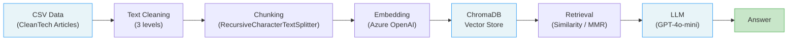

# Retrieval Augmented Generation (RAG) for CleanTech

A Retrieval Augmented Generation pipeline for answering questions about CleanTech news articles. The system ingests a corpus of CleanTech media articles, builds a vector store with Azure OpenAI embeddings, and retrieves relevant context to generate grounded answers using GPT-4o-mini.

## Architecture



### Pipeline Stages

| Stage | Details |
|-------|---------|
| **Data Source** | CleanTech media articles dataset (~1000 articles) |
| **Text Cleaning** | Three configurable levels: *safe* (minimal cleanup), *risky* (remove boilerplate, cookie notices), *dangerous* (aggressive removal of legal text and noise) |
| **Chunking** | LangChain `RecursiveCharacterTextSplitter` with chunk sizes of 200 or 800 tokens, 100-token overlap, separators: `\n\n`, `\n`, `.`, ` ` |
| **Embedding** | Azure OpenAI `text-embedding-ada-002` and `text-embedding-3-large` |
| **Vector Store** | ChromaDB with persistent storage, tested with cosine, inner product (IP), and L2 distance metrics |
| **Retrieval** | Similarity search (k=3, k=5) and Maximum Marginal Relevance (k=5, k=7) |
| **Generation** | GPT-4o-mini with simple and chain-of-thought prompt strategies |

## Evaluation

The pipeline is evaluated using two complementary metric sets:

### RAGAS Metrics
- **Faithfulness** -- measures factual consistency of the answer with the retrieved context
- **Answer Relevancy** -- evaluates how relevant the generated answer is to the question
- **Context Precision** -- assesses whether the retrieved context is focused and relevant
- **Context Recall** -- measures how much of the ground truth is captured by the retrieved context
- **Answer Correctness** -- overall correctness of the generated answer

### Information Retrieval Metrics
- **Precision@k** -- fraction of retrieved documents that are relevant
- **Recall@k** -- fraction of relevant documents that are retrieved
- **MRR** (Mean Reciprocal Rank) -- ranking quality of the first relevant result

### Configurations Tested

The evaluation covers a systematic grid of hyperparameters:

| Parameter | Values |
|-----------|--------|
| Chunk size | 200, 800 |
| Distance metric | Cosine, Inner Product, L2 |
| Embedding model | text-embedding-ada-002, text-embedding-3-large |
| Retrieval strategy | Similarity (k=3, k=5), MMR (k=5, k=7) |
| Prompt type | Simple, Chain-of-Thought |
| Temperature | 0, 0.5, 0.7, 1.0, 2.0 |

All evaluation results are stored as CSVs in `data_mc1/data_evaluierung/`. See the [evaluation notebook](doc/MC1.ipynb) for detailed analysis and visualizations.

## Project Structure

```
RAG/
├── doc/
│   ├── MC1.ipynb                  # Main evaluation notebook
│   └── Tests_TextCleaner.ipynb    # Text cleaner unit tests
├── src/
│   ├── chroma_embedding_pipeline.py  # Embedding + vector store pipeline
│   ├── evaluation.py                 # RAGAS evaluation framework
│   ├── utilities.py                  # Text cleaning (safe/risky/dangerous)
│   ├── plots.py                      # Evaluation visualizations
│   ├── constants.py                  # German/domain stopwords
│   └── credentials.py               # Azure OpenAI config (template)
├── data_mc1/
│   ├── cleantech_media_dataset_v3_2024-10-28.csv
│   ├── cleantech_rag_evaluation_data_2024-09-20.csv
│   ├── data_processed/            # Cleaned parquet files
│   └── data_evaluierung/          # Evaluation result CSVs
├── task/                          # Assignment description
└── archiv/                        # Development notebooks
```

## Setup

### Prerequisites

- Python 3.10+
- Azure OpenAI API access (for embeddings and LLM)

### Installation

```bash
pip install -r requirements.txt
```

### Configuration

Create a `.env` file in the project root with your Azure OpenAI credentials:

```
AZURE_OPENAI_API_KEY=your-api-key
AZURE_OPENAI_ENDPOINT=https://your-resource.openai.azure.com/
```

### Running

Open the evaluation notebook to explore the full pipeline and results:

```bash
jupyter notebook RAG/doc/MC1.ipynb
```

## Tech Stack

| Component | Technology |
|-----------|-----------|
| Orchestration | LangChain |
| Vector Store | ChromaDB |
| Embeddings | Azure OpenAI (text-embedding-ada-002, text-embedding-3-large) |
| LLM | Azure OpenAI GPT-4o-mini |
| Evaluation | RAGAS |
| Data Processing | pandas, NLTK |
| Visualization | matplotlib, seaborn |
